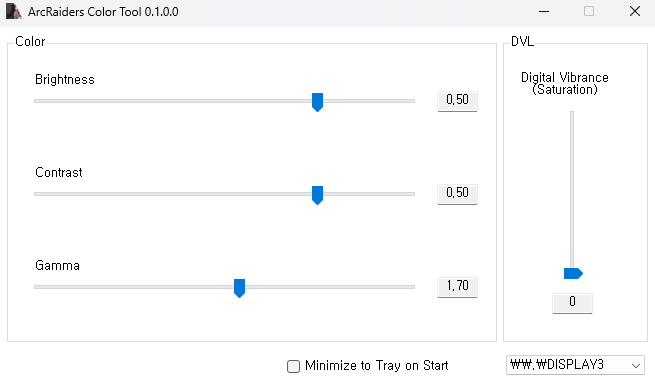

# ArcRaiders Color Tool

## [->**DOWNLOAD Latest**<-](https://github.com/astron8t-voyagerx/ArcRaiders-Color-Tool/releases/latest)

Automatically change color settings for ArcRaiders. This tool is a modified version of the original tarkov-settings project.

## How it works?
- Changes Digital Vibrance value from Nvidia Settings using [NvAPIWrapper](https://github.com/falahati/NvAPIWrapper)
- Changes Gamma using some [Win32 API calls](https://docs.microsoft.com/en-us/windows/win32/api/wingdi/nf-wingdi-setdevicegammaramp)

It only changes your display's colors when the ArcRaiders window is in focus.
This leaves a smooth transition when minimizing/maximizing.

## Supported Graphic Cards
- Nvidia GPU **fully supported.** (Brightness/Contrast/Gamma/Saturation)
- AMD GPU **partially supported.** (Except Saturation)
- **Intel/Etc is not supported yet.**

## What does it do?
You can change any of the following color settings:
1. Brightness
2. Contrast
3. Gamma
4. Digital Vibrance Control (aka. Saturation)
5. Only affects display while the game window is focussed (It also prevents **sudden flash during Alt-tabbing**)

## How to Use
1. Open application (SmartGuard might prevent opening as it's not signed)
2. Set any color value
2.1. Double-click any slider labels to reset their values.
3. Minimize and play ArcRaiders
4. Close application if you want to deactivate

**Exit the app from your taskbar to create a `settings.json` file that will remember your settings**

## Warning
1. It might blink couple times when you active the game window but it works. Don't worry.
2. **Disclaimer: Use this tool at your own risk. The author is not responsible for any game account bans or penalties.**
3. AMD only supports Brightness/Contrast/Gamma Controls
4. Intel Graphic Cards are not supported
5. Only works in **Borderless mode.**
6. Nvidia Optimus Environment (mostly laptops) is not tested.

## TODO / Feature
- [x] Process Focusing Awareness
- [x] Digital Vibrance Value Change
- [x] Gamma Value Change
- [x] Brightness, Contrast, Gamma Value modify
- [x] GUI
- [x] ini or json configuration
- [x] Process Changeability
- [x] change display(monitor) target
- [x] Minimize to tray
- [ ] Profiles
- [ ] Hot Keys
- [ ] Game-specific setting modify (Framelimit or Graphic Settings)

## Credits / Original Project
This project is a fork of [tarkov-settings](https://github.com/incheon-kim/tarkov-settings) created by [incheon-kim](https://github.com/incheon-kim).
A huge thanks to the original author for creating this useful tool.
